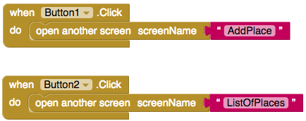

## إنتهيت تقريباً

لقد انتهيت - لديك الآن تطبيق يمكنه إضافة مواقع الأماكن التي من السهل الوصول إليها إلى قاعدة بيانات مشتركة، ثم يُظهر للناس الأماكن الموجودة في قاعدة البيانات القريبة منهم.

لكن انتظر! شيء أخير!

+ تحتاج إلى السماح للأشخاص بالانتقال من شاشة إلى أخرى عن طريق النقر فوق الأزرار. سأدعك ترى هل يمكنك معرفة ذلك.

--- hints ---

--- hint ---

+ ستحتاج إلى إضافة كود إلى الكتلة البرمجية `Button.Click` الخاصة بالأزرار buttons. انظر في كتل التحكم control blocks!

--- hint/ ---

--- hint ---

+ إليك الكود البرمجي الذي تحتاج إلى إضافته إلى الشاشة الرئيسية:

--- hint/ ---

--- hints/ ---

+ الآن كل ما تبقى لك هو اختباره! انتقل إلى قائمة **اتصال Connection ** ثم حدد إما المحاكي emulator أو AICompanion أو أي طريقة أخرى مناسبة لك.

هذا كل شيء - انتهيت! أتساءل ماذا يمكنك أن تفعل الآن بكل الأشياء التي تعلمتها. فيما يلي بعض الاقتراحات القليلة، ولكن يمكنك التفكير بأفكار أكثر روعة.

--- collapse ---
---
title: إظهار المسافة إلى الأماكن
---

+ في الوقت الحالي، تتخلص من جميع الأماكن التي تبعد بأكثر من 5 كيلومترات، لكن لا يمكن للمستخدم رؤية المسافة إلى مكان محدد. ماذا عن إضافة تسمية أخرى إلى القائمة التي تحتوي على المسافة إلى هذا المكان!

--- /collapse ---

--- collapse ---
---
title: حساب المسافة بشكل أفضل
---

فيما يتعلق بموضوع حساب المسافات، فإن الطريقة التي تستخدمها لحساب المسافات في هذه البطاقات غير دقيقة إلى حد ما.

+ كيف تحاول بناء نظام أفضل؟ ابحث عن "App Inventor working out distances" في محرك البحث.

--- /collapse ---

--- collapse ---
---
title: استخدم خريطة بدلاً من كتابة العناوين
---

+ أو ربما يمكنك إضافة خريطة إلى شاشة "AddPlace". في الوقت الحالي ، يجب عليك كتابة عنوان ، لكن ماذا لو كنت تستطيع العثور عليه فقط على الخريطة. سيكون ذلك أكثر روعة!

--- /collapse ---

--- collapse ---
---
title: اصنع تطبيق مختلف!
---

+ لا يوجد سبب لمواصلة العمل على هذا التطبيق إذا كنت لا ترغب في ذلك. الاحتمالات لا حصر لها! باستخدام نفس الكتل، يمكنك استخدام Firebase لإنشاء تطبيق مراسلة أو الاستفادة من الساعة لإنشاء المنبه الخاص بك!

--- /collapse ---

يمكنك رؤية مثال لهذا التطبيق على App Inventor على [dojo.soy/advancedapp](http://dojo.soy/advancedapp){: target = "_ blank"}.
