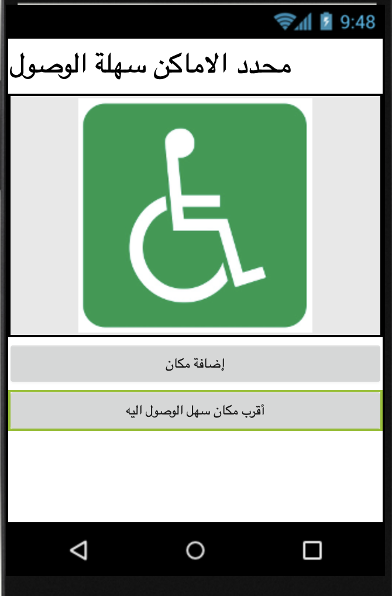

## إنشاء التصميم

+ إنشاء مشروع جديد في App Inventor وتسميته `AccessApp`، أو أخترع اسم جميل خاص بك!

+ أولاً ، ستقوم بإعداد شاشة رئيسية. أضف تسمية label واثنين من الأزرار buttons لتطبيقك. اجعل التسمية باسم التطبيق، واضبط نصوص الأزرار على "إضافة مكان" و "أقرب مكان سهل الوصول إليه".

الآن أنا لا أعرف عنك، لكنني أعتقد أن العنوان يجب أن يكون أكبر!

+ انتقل إلى خصائص التسمية label وقم بتغيير حجم الخط إلى شيء جميل وكبير. اخترت 28 ، ولكن يمكنك أن تختار أكبر!

الآن بما أن لديك هذا العنوان الجديد الجميل واللطيف، فيمكنك التخلص من واحد في الجزء العلوي من الشاشة.

+ انقر على الشاشة screen في ** Components **، وفي خصائصها، قم بإلغاء تحديد خانة **TitleVisible**.

+ هذه الأزرار صغيرة بعض الشيء أيضًا ، لذا انتقل إلى "خصائصهم" وقم بتغيير العرض width إلى `Fill parent`.

+ أخيرًا ، دعنا نضيف صورة. ابحث عن صورة مناسبة أو ارسمها أو استخدم الموجودة هنا: [dojo.soy/accessicon](http://dojo.soy/accessicon){: target = "_ blank}.

+ احصل الآن على مكون صورة Image واسحبه على الشاشة. في خصائصه ، ابحث عن ** Picture **، ثم **Upload File**، وقم بتحميل الصورة التي تريد استخدامها.

--- collapse ---
---
title: توسيط شيء ما
---

حسب حجم الصورة ، قد يكون رائعًا إذا تم عرضها في وسط الشاشة.

+ للقيام بذلك ، ستحتاج إلى ترتيب أفقي HorizontalArrangement من ** Layout **. اسحب واحدة على الشاشة وانقل صورتك إليها.

+ الآن انقر على **HorizontalArrangement** وانتقل إلى خصائصه. اضبط العرض على `Fill parent`، ثم ابحث عن **AlignHorizontal** وقم بالتبديل إلى `Center: 3`.

--- /collapse ---

--- collapse ---
---
title: صورتي أكبر من الشاشة
---

إذا كنت تستخدم صورة كبيرة جدًا ، فلا مشكلة!

+ انقر على الصورة وانظر إلى خصائصها.

+ حدد المربع **ScalePictureToFit**. هذا سوف يقلص الصورة لتناسب الشاشة.

--- /collapse ---

+ مدهش! لقد انتهيت للتو من الشاشة الأولى. إليك ما تبدو عليه الشاشة الخاصة بي:

+ اصنع الآن شاشة أخرى باسم "AddPlace".

+ مثل السابق، قم بإضافة تسمية label مع عنوان الشاشة. أيضاً قم بإضافة تسمية آخرى بالاسم "الموقع:" ، و TextBox ، واثنين من الأزرار Buttons التي تشير إلى "الموقع الحالي" و "حفظ المكان".

+ جرب الآن بعض مهاراتك الجديدة. أعط TextBox عرض "Fill parent" واستخدام اثنين من HorizontalArrangements لتوسيط كلا الأزرار.

قد يبدو أفضل إذا كان زر الحفظ في الأسفل.

+ قم بتغيير ارتفاعه HorizontalArrangment إلى `Fill parent` ثم قم فقط بتعيين الخاصية **AlignVertical** الخاصة به إلى `Bottom: 3`.

+ مدهش! يجب أن يكون لديك شيء كهذا:

+ الآن تحتاج فقط إلى إضافة شاشة أخرى. سمها "ListOfPlaces".

+ هذه بسيطة للغاية: اسحب ListView للخارج وقم بتغيير الارتفاع إلى `Fill parent`.

هذه جميع الشاشات جاهزة!
