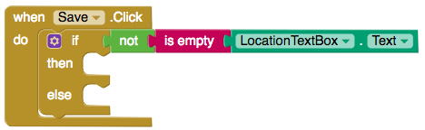
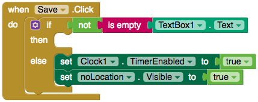

## الحصول على موقع المستخدم

إذا كنت تريد معرفة مكان الأماكن التي من السهل الوصول إليها الموجودة بالقرب منك، فستحتاج إلى أن يضيف المستخدمين مواقعهم على تطبيقك. لحسن الحظ، يحتوي App Inventor على مكون **LocationSensor** والذي يكتشف موقع المستخدم.

+ على شاشة "AddPlace" ، اسحب LocationSensor من **Sensors** إلى تطبيقك.

أنت الآن بصدد الحصول على موقع المستخدم ووضعه في **TextBox**.

+ قم بالتبديل إلى طريقة العرض Blocks واسحب اثنين `من كتل Button.Click` على الشاشة.

--- collapse ---
---
title: إعادة تسمية المكونات
---

أحب إعطاء المكونات الخاصة بي أسماء محددة.

+ في طريقة العرض "مصمم Designer view" ، انقر فوق المكون component. في الجزء السفلي من المقطع **Components** ، انقر فوق **Rename**.

+ قمت بتسمية الازرار الخاصة بي "الموقع الحالي" و "حفظ".

--- /collapse ---

+ اسحب كتل `مجموعة TextBox.Text` على الشاشة وضعها في زر "الموقع الحالي" الخاص بك.

+ الآن اسحب كتلة `LocationSensor.CurrentAddress` وأرفقها بكتل `set TextBox.Text`.

عظيم! الآن عند النقر فوق "GetLocation" ، سيتم تعيين نص TextBox على عنوانك الحالي من LocationSensor.

يجب أن تكون حذراً: إنها لفكرة جيدة أن تتأكد من وجود عنوان في TextBox قبل إضافة مكان جديد! تحتاج إلى **التحقق من صحة المدخلات**.

+ قم بسحب كتلة `if, then, else`، وضعها في كتلة `when Save.Click`.

+ والآن أنت بحاجة لجعل الشرط الخاص بـ`if` أن يكون في حالة وجود نص في مربع النص TextBox. قم بسحب كتلة `فارغ is empty`، وإرفاقه إلى كتلة `TextBox.text`.

+ حسنا، الآن يمكنك التحقق فيما إذا كان مربع النص فارغ، ولكنك تريد معرفة فيما اذا كان **ليس not** فارغاً. للقيام بذلك، قم بجلب كتلة ` not` ووضعها قبل كتلة `is empty`.

شيء أخير: يجب أن تخبر المستخدم أن TextBox فارغ.

+ قم بالتبديل إلى طريقة العرض "مصمم Designer view" واسحب تسمية label إلى التطبيق. أعطه رسالة تحذير وعيّن لون النص باللون الأحمر. أخيرًا ، قم بإلغاء تحديد خانة الاختيار **مرئي Visible**.

+ أنت تريد أن تظهر هذه التسمية لثانية واحدة، لذلك ستحتاج **ساعة Clock**. اسحب واحدة من المستشعرات Sensors- ستظهر مع المكونات الأخرى غير المرئية أسفل شاشة التطبيق.

+ قم بإلغاء تحديد خانة الاختيار **TimerEnabled** حتى لا يتم استخدامها على الفور!

+ مرة أخرى في طريقة "عرض الكتل Blocks view" ، اسحب كتل `set Label.Visible` و `set Clock.TimerEnabled` وأرفق كل منهما إلى كتل`true`. ثم ضع كل منهما في عبارة ` else`.

كدنا نصل! الآن ، إذا لم يكن هناك نص في **TextBox**، فسوف تصبح تسمية التحذير مرئية وسيتم تمكين الساعة. تحتاج فقط إلى جعل التسمية غير مرئية مرة أخرى بعد حوالي ثانية واحدة ، لذلك لا يتعين على المستخدم متابعة النظر إليها.

+ أخرج الكتلة `when Clock.Timer` وكرر الكتلتين اللاتي قمت بإنشائهما للتو. غيّر `true` إلى `false` وضع كتل مكررة داخل `when Clock.Timer`.

