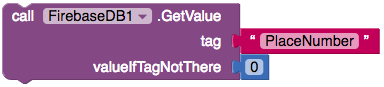
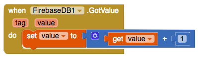
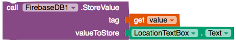
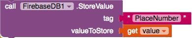
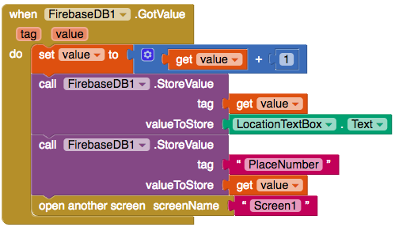

## حفظ البيانات إلى Firebase

للسماح لجميع مستخدمي تطبيقك بمشاهدة جميع الأماكن التي يمكن الوصول إليها ، تحتاج إلى تخزين البيانات عبر الإنترنت. للقيام بذلك ، يحتوي App Inventor على قاعدة بيانات على الويب يمكنك كتابة القيم عليها ثم العودة إليها لاحقًا.

+ وانت موجود على شاشة **AddPlace**، انتقل إلى طريقة العرض **Designer** واسحب مكون **FirebaseDB** (**Palette** > **Experimental**) إلى التطبيق الخاص بك. لا تقلق إذا ظهرت لك رسالة، فما عليك سوى النقر فوق ** OK **.

+ بالرجوع الى طريقة العرض "Blocks" ، أضف كتلة `call FirebaseDB.StoreValue`.

--- collapse ---
---
title: ما هي العلامات والقيم؟
---

يمكنك أن ترى أن كتلة `StoreValue` تطلب قيمتين:
  + العلامة ** tag ** هو معرف فريد التي ستستخدمها لاسترداد البيانات في وقت لاحق
  + و القيمة ** value ** هي البيانات التي تريد حفظها

الشيء المهم هو أن **العلامة tag ** يجب أن تكون فريدة من نوعها (أي يتم استخدامها مرة واحدة فقط). وتحتاج إلى التأكد من أن لا أحد يعيد استخدام نفس العلامة. وإلّا فستفقد البيانات التي تحمل هذه العلامة!

للتأكد من عدم حدوث ذلك، ستخبر Firebase بتخزين قيمة `PlaceNumber` والتي ستستمر في الاضافة اليها. وهذا ستكون العلامة الخاصة بك.

--- /collapse ---

+ أضف كتلة `call Firebase.GetValue` إلى عبارة `then` الموجودة في كتلة `when Save.Click`.

+ قم بإضافة كتلة `نص text ` مع العلامة تكون `"PlaceNumber"` و كتلة `0` لـ **ValueIfTagNotThere**:

--- collapse ---
---
title: لماذا لا يتم إرجاع القيمة؟
---

في الوقت الحالي ، يقوم برنامجك بسؤال Firebase عن العدد الحالي من الأماكن. سيبحث Firebase عنها وبمجرد العثور على العدد، سوف يستدعي دالة أخرى، في هذه الحالة `GotValue`.

يُعرف هذا بـ **مكالمة غير متزامنة** ويعني أنه يمكن أن يستمر تطبيقك أثناء انتظار Firebase!

--- /collapse ---

+ بمجرد أن يجد Firebase القيمة ، سيتم تشغيل وظيفة `GotValue`. لذا، قم بإضافة `when Firebase.GotValue`، بحيث يمكنك تشغيل بعض التعليمات البرمجية عند حدوث ذلك.

+ أولاً ، تحتاج إلى زيادة كمية الأماكن (كلما تضيف موقع جديد). ضع مؤشر الفأرة فوق ` value ` واسحب كتلة `set value to`. ضعه في كتلة `when Firebase.GotValue`. وقم بأخذ كتلة `get value`.

+ من Math ، اسحب كتلة `+` مع كتلة `0`. قم بتعيين الكتلة `0` إلى `1`.

+ ضع الكتل `get value` و `0` في كتلة `+`، وأرفق كتلة `>set value to`.

+ الآن لديك علامة فريدة: لقد قمت للتو بزيادة `"PlaceNumber"` بمقدار `1`. في المرة التالية التي يضيف بها شخص ما مكان، سيقوم أيضا بزيادة `"PlaceNumber"` تلقائياً، لذلك بطاقة الخاصة بك ** tag ** ستبقى دائما فريدة من نوعها!

+ اسحب كتلة `FirebaseDB.StoreValue` التي قمت بإضافتها مسبقًا إلى أسفل الكتلة `set value to` كتل:

هذه الكتلة تخبر قاعدة بيانات Firebase لتخزين موقع (العنوان في TextBox). عندما تريد البحث عن العنوان مرة أخرى ، يمكنك استخدام العلامة الخاصة به (والتي قيمتها `"PlaceNumber"`).

+ قم بتوصيل كتلة `get value` بالعلامة `tag` ، و `TextBox.text` للملحق `value`.

+ الشيء الوحيد المتبقي هو تغيير كمية الأماكن في Firebase. هذه الكود نفسها تمامًا مثل الكتلة السابقة، فقط مع تغيير العلامة والقيمة. جربها بنفسك! يجب أن تكون أسفل كتلة الاستدعاء السابق `call Firebase.StoreValue`.

--- hints ---

--- hint ---

+ القيمة التي تريد تخزينها هي القيمة الجديدة لعدد الأماكن.

+ استخدم العلامة التي حددتها سابقًا للحصول على رقم المكان الحالي وتخزينه.

--- hint/ ---

--- hint ---

+ لتحديث عدد الاماكن، تحتاج إلى `call FirebaseDB.StoreValue` مع ` tag ` من `"PlaceNumber"` و ` value ` من `get value`. إليك ما يبدو عليه الكود:

--- /hint ---

--- hints/ ---

+ رائع! يمكنك الآن إضافة أماكن جديدة إلى التطبيق. فقط أضف كتلة `open another screen screenName` وأرفقها بكتلة `""`. اكتب `Screen1` هنا ، حتى تتمكن من العودة إلى الشاشة الرئيسية.

يجب أن تكون التعليمات البرمجية الخاصة بـ `GotValue` كما يلي الآن:

