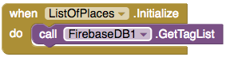
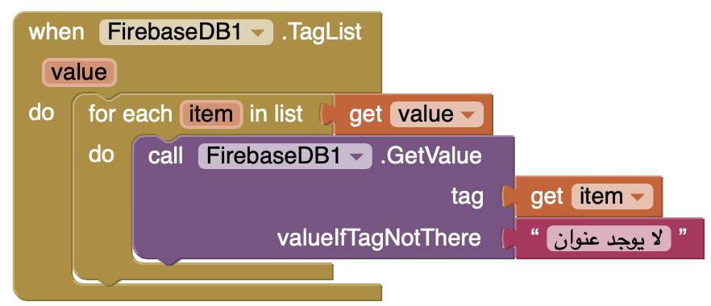
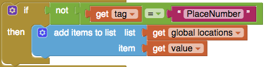
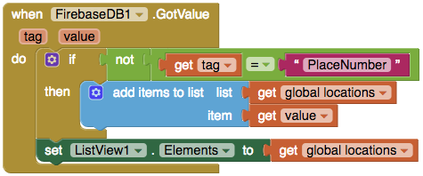

## عرض البيانات في ListView

تكمن الخطوة التالية في إنشاء التطبيق الخاص بك في إنشاء طريقة لرؤية جميع أماكن الوصول. تريد برمجته بحيث يجد جميع إدخالات الأماكن ثم يضيف كل عنصر كعنصر من عناصر ListView في شاشة ListOfPlaces. للقيام بذلك ، ستحتاج إلى مكون FirebaseDB مرة أخرى.

+ قم بالتبديل إلى شاشة ListOfPlaces واسحب مكون FirebaseDB في طريقة العرض "مصمم Designer".

+ انتقل الآن إلى طريقة العرض Blocks واخرج كتلة `when ListOfPlaces.Initialize`. سيتم تشغيل كل شيء هنا بمجرد فتح هذه الشاشة.

+ ضع كتلة `call FireBase.GetTagList` داخلها. هذا يخبر Firebase بإرجاع قائمة تحتوي على علامات جميع البيانات المحفوظة في قاعدة البيانات الخاصة بك.

+ خذ كتلة `when FireBase.TagList` وقم بإدراج كتلة `for each item in list` داخلها. سيتم تشغيل هذه الوظيفة بمجرد حصول Firebase على مجموعة العلامات الخاصة بنا في شكل قائمة ، والتي تستخدمها كمتغير `value`.

مع حلقة `for` لديك الآن علامات فردية تم تعيينها إلى متغير item. بالطبع لا تريد العلامة ،أنت تريد العنوان، وستستخدم العلامة للحصول عليها.

قم بأخذ كتلة `call Firebase.GetValue`، وقم بتعيين العلامة إلى المتغير `item`، لأنه يحتوي على العلامة الحالية من قائمة `value`.

+ قم بإضافةكتلة `when Firebase.GotValue`، وضع كتلة `add items to list` داخلها.

+ سوف تحتاج إلى قائمة لإضافة المواقع، لذلك قم بإضافة كتلة `initialize global name`. وقم بتغيير الاسم من ` name ` إلى ` locations` واسحب كتلة `create empty list` واربطها في نهايتها.

+ الآن قم بإرفاق كتلة `get global locations` إلى قائمة المرفقات في `add items to list`، و كتلة `get value` إلى مرفق العنصر item. يحتوي المتغير `value` على عنوان المكان.

**ملاحظة**: قائمة العلامات تحتوي أيضا على العلامة `"PlaceNumber"` التي تستخدمها لحفظ عدد الأماكن، لذلك ستحتاج إلى استبعادها من القائمة التي تعرضها.

+ قم بإضافة كتلة `if then` من ادوات التحكم Control لديك الى كتلة `GotValue`، ثم قم بنقل الكود في `add items to list` الى داخل كتلة `then`.

+ في جزء `if`: أرفق `not` و `=` من Logic. مرّر مؤشر الماوس فوق المتغير `tag` وضع `get tag` على يسار `=`. ثم ضع كتلة النص `""` على اليمين واكتب `"PlaceNumber"` فيها.

+ أخيرًا ، يلزمك إخبار ListView للحصول على عناصره من قائمتك. قم بالحصول على كتلة`set ListView.Elements` وإرفق كتلة `get global locations` إليها.

