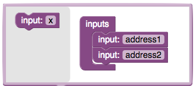
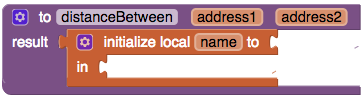
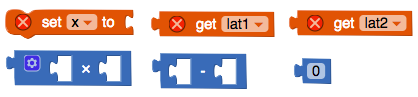
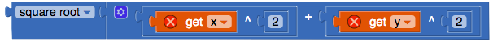

## تنفيذ إجراء لحساب المسافات

الآن بعد أن عرفت كيفية حساب المسافة، يمكنك جعل تطبيقك لا يعرض سوى الأماكن التي تقع على بعد 5 كيلومترات من المستخدم.

+ اسحب كتلة **إجراء procedure ** (التي تحتوي على result) ، وسمّها مسافة `distanceBetween`. انقر على رمز زر مفتاح الربط في أعلى الزاوية اليسرى واسحب اثنين من inputs إليه. واطلق عليها هذه الاسماء `address1` و `address2`.

+ بعد ذلك، من قسم المتغيرات Variables، اسحب كتلة `initialize local name to` (التي تحتوي على مرفق جانبي بدلا من التي تحتوي على مرفق من الأعلى).

+ أضف ستة متغيرات له: `lat1`، `long1`، `lat2`، `long2`، `x`، و `y`. استخدم نفس الطريقة التي استخدمتها للإجراء ، من خلال النقر على أيقونة مفتاح الربط في زاوية كتلة `initialise local`.

+ أنت الآن بحاجة إلى طريقة لتحويل عناوين النص إلى إحداثيات خطوط الطول والعرض. لحسن الحظ ، يقوم LocationSensor بذلك ، لذا انتقل إلى عرض **Designer** وأضف واحدًا.

+ إحصل على كتلتين من `call LocationSensor.LatitudeFromAddress`. إرفق كتلة `get address1` لواحدة، و كتلة `get address2` للاخرى. ضع هذه في المرفقات `lat1` و `lat2`.

+ كرر نفس الشيء مع خط الطول.

+ اسحب كتلتي `0` وقم بإرفاقهما لكتلتي `initialize local x to` و `initialize local y to`.

+ احصل على كتلة `do result` من التحكم Control، وضعها في مرفق ` in ` من كتلة `initialize local` (التي هي كبيرة جدا الآن!).

عظيم! الآن تحتاج إلى حساب المسافة.

+ اخرج الكتل `set x to`، `get lat1`، `get lat2`، `x`، `-`، و `0`.

+ ضع الكتل`get lat2` و `get lat1` في كتلة `-` ثم ضع كتلة `-` في كتلة `x`.

الآن لديك الفرق في خطوط العرض!

+ اضرب هذا في `111` لتحصل على المسافات بالكيلومترات بين خطي العرض. ثم قم فقط بتوصيل ذلك إلى كتلة `set x to`، ثم ضع كتلة `set x to` في القسم `do` من كتلة `do result`.

+ قم بالشيء نفسه مع كتلة `set y to`، مع تغيير `111` إلى `89` و ` lat ` إلى ` long`.

ممتاز! مع ذلك لديك أطوال اثنين من جوانب المثلث الخاص بك لاستخدامها في صيغة المسافة!

+ من قسم الرياضيات Math، احصل على كتل `square root` و `+` مع كتلتين من `^`(علامة الأس أو مرفوع العدد) وكتلتين من `0`.

+ ضع `get x` في الإدخال الأيسر لأحد كتل `^`، ثم ضع `get y` في الإدخال الأيسر من الآخرى. ضع الكتل `0` في كتل `^` أيضًا، مع تغيير `0` إلى `2`.

سيؤدي هذا إلى تربيع كل من `×` و `y` (إن مربع `×` هو `×` مضروبة في `×`، وهذا يعني `×^2 = × * ×`).

+ ضع كلاً من كتل `^` في كتلة `+` وأرفقها بكتلة `square root`. أخيرًا ، قم بتوصيل هذا في مرفق النتيجة. 

إليك ما يجب أن تبدو عليه الكتل البرمجية لـ `distanceBetween`:

