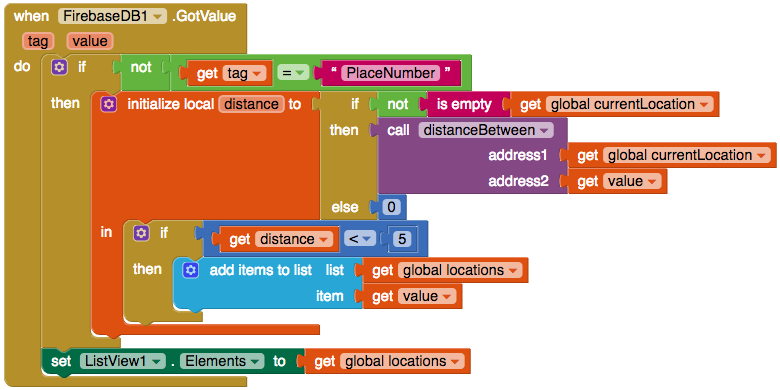

## تصفية حسب المسافة

عظيم! لديك الآن إجراء يمكنه تحديد المسافة بين عنوانين. بعد ذلك، ستضيف هذا إلى الدالة `when FireBase.GotValue`.

لهذا تحتاج بالطبع إلى عنوانين: عنوان المكان الذي يمكن الوصول إليه وعنوانك (عنوان مستخدم التطبيق).

+ أولا يجب أن تحصل على موقعك الحالي. نظرًا لأنك ستستخدم هذه القيمة عدة مرات ، فمن المستحسن تخزينها كمتغير. قم بإضافة كتلة `initialize global name to`، وتغيير اسمه إلى `currentLocation`، وقم بتعيينه إلى كتلة نص text فارغة.

+ في الكتلة `when ListOfPlaces.Initialize`، قم بإضافة كتلة `set global currentLocation to` وقم بتوصيله مع كتلة `get LocationSensor.CurrentAddress`.

ولكن ماذا لو كان موقع المستخدم غير متاح؟ لتغطية هذا الاحتمال ، تحتاج إلى إجراء فحص قبل تعيين المتغير `currentLocation`.

+ ضع كتلة `if then` في `when ListOfPlaces.Initialize` وانقل الكود `set global currentLocation` إلى `then`.

+ ابحث عن الكتلة `LocationSensor.HasLongitudeLatitude` وأرفقها بـ ` if `:

أنت الآن جاهز لاستخدام الإجراء الذي قمت به للحصول على المسافة.

+ قم بإدراج كتلة `initialize local name to` (الذي مع ملحق أعلى) إلى `then` الموجودة في `when FireBase.GotValue`، وتغيير الاسم `name` إلى`distance`.

+ أنت ترغب فقط في استخدام صيغة المسافة إذا كنت تعرف موقع المستخدم، وذلك بتوصيل كتلة `if then else`(التي تحتوي على مرفق جانبي). في كتلة `if`، قم بإرفاق ثلاث كتل: `not` (منطقي Logic) و `is empty` (نص Text) و `get global currentLocation`.

+ قم بتوصيل كتلة `call distanceBetween` إلى ` then`. إذا كان `currentLocation` فارغًا ، فستظهر لك كل الأماكن فقط ، لذا ضع كتلة رياضيات `0` في ` else ` لإرجاع صفر على أنها المسافة.

+ لواحدة من المعاملات** parameters ** (القيم التي تمرر إلى وظيفة) الموجودة في`call distanceBetween`، قم بإرفاق كتلة `get global currentLocation`. بالنسبة إلى المعامل الأخر، قم بإرفاق كتلة `get value` (تذكر أن هذا يحتوي على عنوان المكان الذي حصلت عليه من Firebase).

+ داخل كتلة `initialize local distance to`، قم بإضافة كتلة `if then`.

ستقوم الآن بالتحقق مما إذا كانت المسافة أقل من 5 كم.

+ إحصل على كتلة `<` وكتلة `0` من قسم الرياضيات.

+ ضع `get distance` في الإدخال الأول في الكتلة `<` ، وكتلة `0` في الإدخال الثاني. اضبط الكتلة `0` على `5`.

+ قم بتوصيل كتلة `<` مع كتلة `if then`.

+ انقل الكتلة `add items to list` بحيث تكون داخل العبارة `then` من كتلة `if then`.

+ إذا سار كل شيء بشكل صحيح ، فيجب أن يبدو كما يلي:

