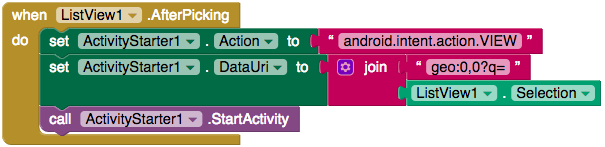

## عرض المواقع في تطبيق الخرائط

رائع! لقد فعلت الكثير ، والتطبيق قد انتهى تقريبًا. آخر ما يجب فعله هو أن يُظهر للناس كيف يمكنهم الوصول إلى مكان ما.

في البرمجة يقولون إن من يبني "يقف على أكتاف العمالقة". هذا يعني أنك تنشئ برامج باستخدام ما تم إنشاءه بالفعل. في حالتك ، لإعطاء الناس توجيهات إلى مكان ما ، سيكون من الأفضل استخدام تطبيق خرائط مثبت بالفعل.

على Android ، يمكن القيام بذلك باستخدام طريقة **StartActivity**. هذا جزء من نظام التشغيل Android ويسمح للتطبيقات بتشغيل أنشطة مثل فتح تطبيق آخر ، والتقاط صورة ، إلخ. يمكن App Inventor أيضًا run هذه الطريقة ، ولكن للقيام بذلك ، يحتاج إلى مكون جديد.

+ قم بالعودة إلى طريقة العرض "Designer" واسحب مكون **ActivityStarter** من **Connectivity**.

حسنا ، حان الوقت لإضافة آخر جزء من الكود!

+ قم بالعودة إلى طريقة العرض "Blocks" واسحب كتلة `when ListView.AfterPicking`.

+ قم بإنشاء كتلة `set ActivityStarter.Action to` واسحب كتلة `""` فيه.

+ داخل هذه الكتلة `""`، أكتب `android.intent.action.VIEW`. هذا هو الإجراء الذي تريد تنفيذه: فأنت تخبر Android بأنك ترغب في عرض شيء ما.

بالطبع يمكنك مشاهدة الكثير من الأشياء: الخرائط ، مواقع الويب ، جهات الاتصال ، أي شيء على الجهاز. لذلك تحتاج أيضًا إلى إخبار ActivityStarter بما تريد عرضه.

+ خذ مجموعة `ActivityStarter.DataURI` وقم بوضعها أسفل الكتلة السابقة.

تريد تمرير جملة تخبر Android أنك تريد رؤية خريطة وأيضًا الموقع الذي ترغب في رؤيته.

+ إحصل على كتلة `join` وقم بتوصيلها إلى كتلة `""`. قم بكتابة العبارة `geo:0,0?q=`.

إن الجزء `geo` يخبر Android بأنك تريد خريطة، بينما يقول الجزء `?q=` بأنك تريد أن ترى العنوان التالي.

+ بالطبع ، أنت الآن بحاجة إلى عنوان ، لذلك أرفق كتلة `ListView.Selection`.

+ أخيرًا ، اسحب كتلة `ActivityStarter.StartActivity` إلى الكتلة السابقة.

