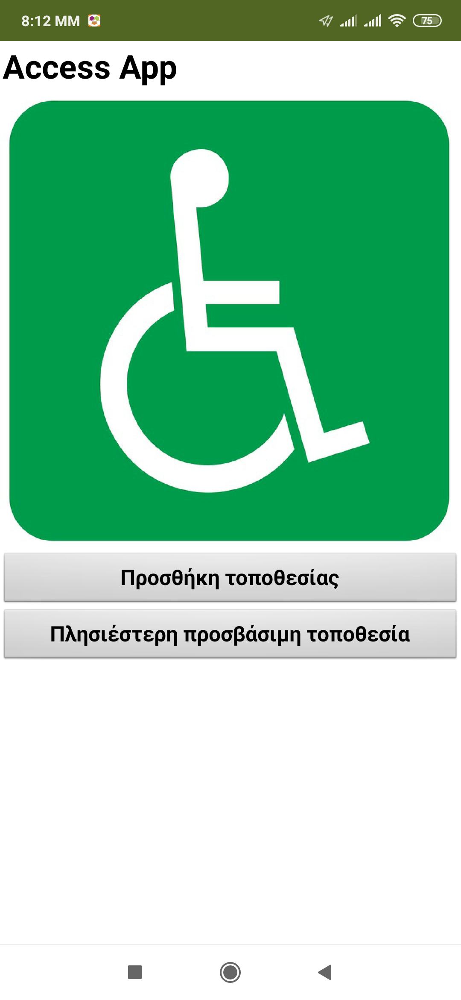
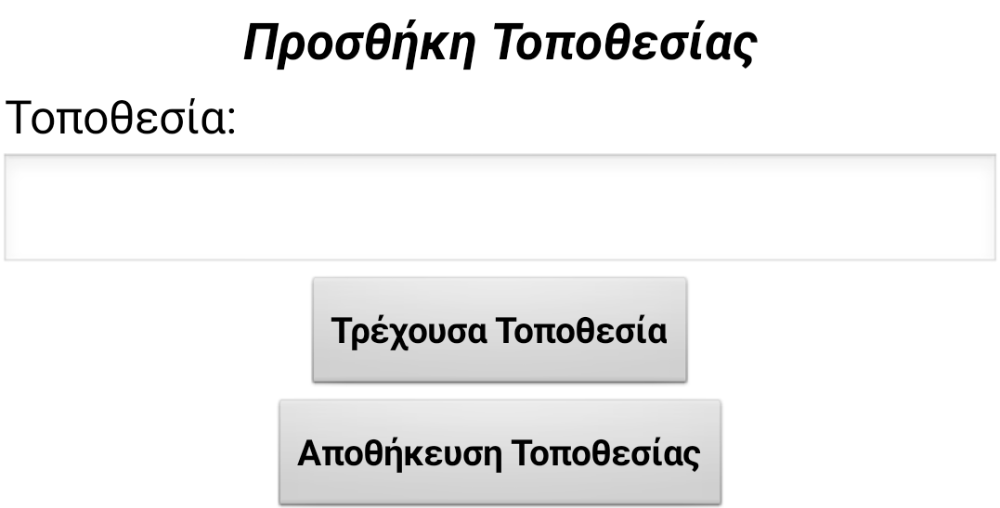
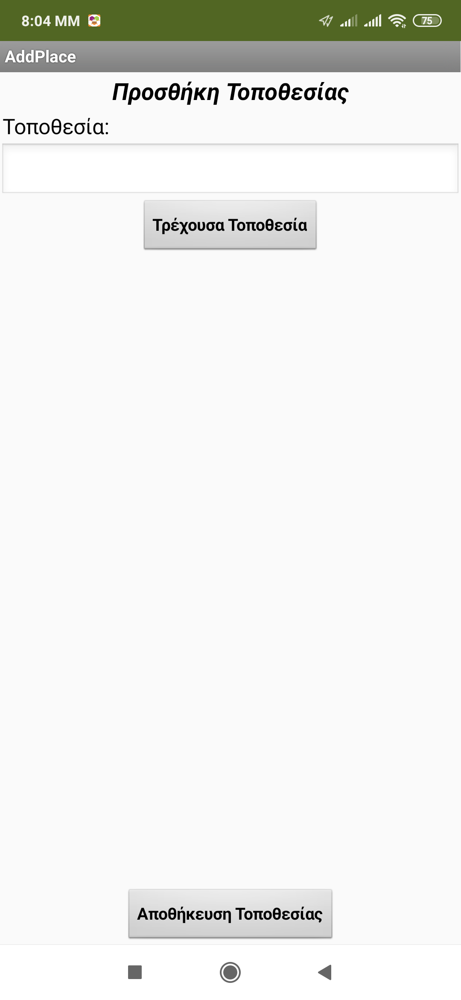

## Δημιουργία της διάταξης

+ Δημιούργησε ένα νέο έργο στο App Inventor και ονόμασέ το `AccessApp` ή σκέψου μόνος σου ένα ελκυστικότερο όνομα!

+ Πρώτα θα δημιουργήσεις την αρχική οθόνη. Πρόσθεσε μια ετικέτα και δύο κουμπιά στην εφαρμογή σου. Κάνε την ετικέτα να λέει το όνομα της εφαρμογής και όρισε τα κείμενα των κουμπιών σε "Προσθήκη τοποθεσίας" και "Πλησιέστερη προσβάσιμη τοποθεσία".

Τώρα δεν ξέρω για σένα, αλλά νομίζω ότι ο τίτλος θα πρέπει να είναι μεγαλύτερος σε μέγεθος!

+ Πήγαινε στις ιδιότητες της ετικέτας και άλλαξε το FontSize σε κάτι ωραίο και μεγάλο. Διάλεξα 28, αλλά θα μπορούσες να επιλέξεις μεγαλύτερο μέγεθος!

Τώρα που έχεις αυτόν το νέο, ωραίο, μεγάλο τίτλο, μπορείς να απαλλαγείς από αυτόν στην κορυφή της οθόνης.

+ Κάνε κλικ στην οθόνη (Screen1) κάτω από την ενότητα **Components** και στις ιδιότητές της, αποεπίλεξε το πλαίσιο ελέγχου **TitleVisible**.

+ Τα κουμπιά αυτά είναι λίγο μικρά, οπότε πήγαινε στις ιδιότητές τους και άλλαξε την ιδιότητα Width του καθενός σε `Fill parent`.

+ Τέλος, ας προσθέσουμε μια εικόνα. Βρες ή σχεδίασε μια κατάλληλη εικόνα ή χρησιμοποίησε αυτήν εδώ: [dojo.soy/accessicon](http://dojo.soy/accessicon){: target = "_ blank"}.

+ Τώρα πάρε ένα στοιχείο Image και σύρε το στην οθόνη. Στις ιδιότητές του, βρες το **Picture**, στη συνέχεια το **Upload File** και μεταφόρτωσε την εικόνα που θέλεις να χρησιμοποιήσεις.

--- collapse ---
---
title: Κεντράρισε κάτι
---

Ανάλογα με το μέγεθος της εικόνας σου, ίσως να ήταν εντυπωσιακότερο να εμφανιστεί στο κέντρο της οθόνης.

+ Για να γίνει αυτό, θα χρειαστείς το στοιχείο HorizontalArrangement από το μενού **Layout**. Σύρε ένα στην οθόνη και μετακίνησε την εικόνα σου μέσα σ' αυτό.

+ Τώρα κάνε κλικ στο στοιχείο **HorizontalArrangement** και πήγαινε στις ιδιότητες του (Properties). Ρύθμισε την ιδιότητα Width σε `Fill parent`, στη συνέχεια βρες την ιδιότητα **AlignHorizontal** και άλλαξέ την σε `Center: 3`.

--- /collapse ---

--- collapse ---
---
title: Η εικόνα μου είναι μεγαλύτερη από την οθόνη
---

Αν χρησιμοποιείς μια εικόνα που είναι πολύ μεγάλη, δεν υπάρχει πρόβλημα!

+ Κάνε κλικ στην εικόνα και δες τις ιδιότητες της.

+ Επίλεξε το πλαίσιο **ScalePictureToFit**. Αυτό θα συρρικνώσει την εικόνα ώστε να ταιριάζει στην οθόνη.

--- /collapse ---

+ Φοβερό! Μόλις ολοκλήρωσες την πρώτη οθόνη. Δες πώς μοιάζει η δική μου:

+ Τώρα δημιούργησε μια άλλη οθόνη με το όνομα "AddPlace".

+ Όπως και πριν, πρόσθεσε ένα Label με τον τίτλο της οθόνης. Επίσης, πρόσθεσε ένα άλλο Label που να αναγράφει "Τοποθεσία:", ένα TextBox και δύο Buttons που να αναγράφουν αντίστοιχα "Τρέχουσα τοποθεσία" και "Αποθήκευση τοποθεσίας".

+ Τώρα δοκίμασε μερικές από τις νέες σου δεξιότητες. Δώσε στην ιδιότητα Width του TextBox την τιμή "Fill parent" και χρησιμοποίησε δύο HorizontalArrangements για να κεντράρεις και τα δύο κουμπιά.

Μπορεί να φαίνεται καλύτερα αν το κουμπί αποθήκευσης είναι στο κάτω μέρος.

+ Άλλαξε το ύψος της ιδιότητας HorizontalArrangment του Button σε `Fill parent` και στη συνέχεια απλά θέσε την τιμή της ιδιότητας **AlignVertical** σε `Bottom: 3`.

+ Φοβερό! Θα πρέπει να έχεις κάτι τέτοιο:

+ Τώρα χρειάζεται μόνο να προσθέσεις μια ακόμη οθόνη. Ονόμασέ την "ListOfPlaces".

+ Αυτό είναι πραγματικά απλό: σύρε ένα ListView έξω και άλλαξε την ιδιότητά του Height σε `Fill parent`.

Έτσι είναι έτοιμες όλες οι οθόνες σου!
