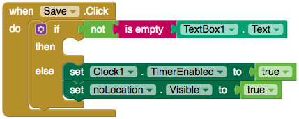

## Λήψη της τοποθεσίας του χρήστη

Εάν θέλεις να μάθεις πού βρίσκονται τα προσβάσιμα μέρη κοντά σου, θα χρειαστείς χρήστες για να προσθέσουν τις τοποθεσίες τους στην εφαρμογή σου. Ευτυχώς, το App Inventor έχει το στοιχείο **LocationSensor** που εντοπίζει την τοποθεσία του χρήστη.

+ Στην οθόνη "AddPlace", σύρε ένα στοιχείο LocationSensor από την κατηγορία **Sensors** στην εφαρμογή σου.

Τώρα θα λάβεις τη θέση του χρήστη και θα τη βάλεις στο **TextBox**.

+ Πήγαινε στην προβολή "Blocks" και σύρε δύο `when Button.Click` μπλοκ στην οθόνη.

--- collapse ---
---
title: Μετονομασία στοιχείων
---

Μου αρέσει να δίνω στα συστατικά της εφαρμογής μου αναγνωρίσιμα ονόματα.

+ Στην προβολή Designer κάνε κλικ στο στοιχείο που θες. Στο κάτω μέρος της ενότητας **Components**, κάνε κλικ στο **Rename**.

+ Ονόμασα τα κουμπιά μου "currentLocation" και "Save".

--- /collapse ---

+ Σύρε το `set TextBox.Text` μπλοκ στην οθόνη και βάλτο στο κουμπί με την ονομασία "Current Location".

+ Τώρα σύρε ένα `LocationSensor.CurrentAddress` μπλοκ έξω και κούμπωσέ το στο μπλοκ `set TextBox.Text`.

Εξαιρετικά! Τώρα όταν κάνεις κλικ στο κουμπί "GetLocation", το κείμενο του TextBox θα οριστεί στην τρέχουσα διεύθυνση σου από το LocationSensor.

Πρέπει όμως να είσαι προσεκτικός: είναι καλή ιδέα να ελέγχεις ότι υπάρχει πάντα μια διεύθυνση στο TextBox πριν προσθέσεις μια νέα θέση! Θα πρέπει **επικυρώσεις τα εισαγόμενα στοιχεία**.

+ Σύρε ένα `if, then, else` μπλοκ, και βάλτο στο `when Save.Click` μπλοκ.

+ Τώρα πρέπει να κάνεις την συνθήκη `if` να ελέγχει εάν το TextBox περιέχει κείμενο. Σύρε ένα `is empty` μπλοκ και κούμπωσέ το σε ένα block `TextBox.text`.

+ Εντάξει, τώρα μπορείς να ελέγχεις αν το TextBox είναι άδειο, αλλά θέλεις να ελέγχεις αν **δεν** είναι άδειο. Για να το κάνεις αυτό, πάρε ένα `not` μπλοκ και βάλε το πριν το `is empty` μπλοκ.

Ένα τελευταίο πράγμα: πρέπει να πεις στο χρήστη ότι το TextBox είναι κενό.

+ Πήγαινε στην προβολή Designer και σύρε ένα Label στην εφαρμογή. Δώσε του ένα προειδοποιητικό μήνυμα και όρισε το χρώμα του κειμένου σε κόκκινο. Τέλος, αποεπίλεξε το πλαίσιο ελέγχου **Visible**.

+ Θα θέλεις να εμφανίζεται αυτή η ετικέτα (Label) για ένα δευτερόλεπτο, οπότε θα χρειαστείς ένα ρολόι **Clock**. Σύρε το έξω από την κατηγορία Sensors - θα εμφανιστεί με τα άλλα μη ορατά συστατικά κάτω από την οθόνη της εφαρμογής.

+ Αποεπίλεξε το πλαίσιο ελέγχου **TimerEnabled** του ρολογιού ώστε να μην ξεκινήσει αμέσως!

+ Πίσω στην προβολή Blocks, σύρε ένα `set Label.Visible` και ένα `set Clock.TimerEnabled` μπλοκ και κούμπωσέ τα και τα δύο με δύο `true` μπλοκ. Στη συνέχεια, βάλτα και τα δύο στην εντολή `else`.

Σχεδόν τελείωσες! Τώρα, εάν δεν υπάρχει κείμενο στο **TextBox**, η προειδοποιητική σου ετικέτα θα γίνει ορατή και το ρολόι σου θα ενεργοποιηθεί. Απλά πρέπει να κάνεις την ετικέτα αόρατη και πάλι μετά από περίπου ένα δευτερόλεπτο, για να μην αναγκάζεται ο χρήστης να τη βλέπει συνεχώς.

+ Βγάλε ένα `when Clock.Timer` μπλοκ και κάνε αντιγραφή (duplicate) τα δύο μπλοκ που μόλις δημιούργησες. Άλλαξε το `true` σε `false` και βάλε τα δύο αντίγραφα μέσα στο `when Clock.Timer` μπλοκ.

