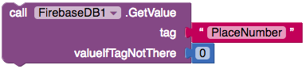
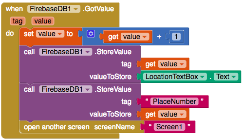

## Αποθήκευση δεδομένων στο Firebase

Για να επιτρέψεις σε όλους τους χρήστες της εφαρμογής σου να βλέπουν όλα τα προσβάσιμα μέρη, πρέπει να αποθηκεύσεις τα δεδομένα στο διαδίκτυο. Για να το κάνεις αυτό, το App Inventor διαθέτει μια βάση δεδομένων ιστού στην οποία μπορείς να γράφεις τιμές και στη συνέχεια να τις ανακτάς.

+ Μένοντας στην οθόνη **AddPlace**, πήγαινε στην προβολή **Designer** και σύρε ένα **FirebaseDB** (**Palette** > **Experimental**) στοιχείο στην εφαρμογή σου. Μην ανησυχείς αν λάβεις ένα αναδυόμενο μήνυμα, απλά προχώρησε και κάνε κλικ στο κουμπί **OK**.

+ Πίσω στην προβολή μπλοκ, πρόσθεσε ένα μπλοκ `call FirebaseDB.StoreValue`.

--- collapse ---
---
title: Τι είναι οι ετικέτες (tags) και οι τιμές (values);
---

Μπορείς να δεις ότι το μπλοκ `StoreValue` ζητά δύο τιμές:
  + Το **tag** είναι ένα μοναδικό αναγνωριστικό που θα χρησιμοποιήσεις για να ανακτήσεις τα δεδομένα αργότερα
  + Το **value** είναι τα δεδομένα που θέλεις να αποθηκεύσεις

Το σημαντικό είναι ότι ένα **tag** πρέπει να είναι μοναδικό (δηλαδή χρησιμοποιείται μόνο μία φορά). Πρέπει να βεβαιωθείς ότι κανείς ποτέ δεν θα ξαναχρησιμοποιήσει το ίδιο tag. Εάν αυτό συνέβαινε, τότε τα δεδομένα με αυτό το tag θα χάνονταν!

Για να βεβαιωθείς ότι αυτό δεν συμβαίνει, θα πεις στο Firebase να αποθηκεύσει μια τιμή `PlaceNumber` την οποία συνεχώς θα αυξάνεις. Αυτή θα είναι το tag σου.

--- /collapse ---

+ Πρόσθεσε ένα `call Firebase.GetValue` μπλοκ στην εντολή `then` στο `when Save.Click` μπλοκ.

+ Πρόσθεσε ένα block `text` με `"PlaceNumber"` ως tag και ένα μπλοκ `0` για το **ValueIfTagNotThere**:

--- collapse ---
---
title: Γιατί η τιμή δεν επιστρέφεται;
---

Αυτή τη στιγμή ο κώδικας σου ζητά από το Firebase το τρέχων σύνολο τοποθεσιών. Το Firebase θα το ψάξει αυτό και μόλις βρει την τιμή, θα καλέσει μια άλλη λειτουργία, την `GotValue` σε αυτή την περίπτωση.

Αυτό είναι γνωστό ως **ασύγχρονη κλήση** και σημαίνει ότι η εφαρμογή σου μπορεί να συνεχίσει να τρέχει, ενώ περιμένει την απάντηση από το Firebase!

--- /collapse ---

+ Μόλις το Firebase εντοπίσει την τιμή, θα εκτελέσει τη λειτουργία `GotValue`. Συνεπώς, προχώρησε και πρόσθεσε ένα `when Firebase.GotValue` μπλοκ, ώστε να μπορείς να εκτελέσεις κάποιον κώδικα όταν αυτό συμβεί.

+ Πρώτα πρέπει να αυξήσεις το σύνολο των τοποθεσιών (καθώς θα προσθέτεις μια νέα). Πέρνα το ποντίκι πάνω από τη λέξη `value` και σύρε έξω ένα `set value to` μπλοκ. Βάλε το στο μπλοκ `when Firebase.GotValue`. Επίσης, βγάλε ένα μπλοκ `get value`.

+ Από το Math, σύρε έξω το μπλοκ `+` μαζί με ένα μπλοκ `0`. Όρισε το μπλοκ `0` σε `1`.

+ Τοποθέτησε τα `get value` και `0` μπλοκ στο `+` μπλοκ και κούμπωσέ τα στο `set value to` μπλοκ.

+ Τώρα έχεις ένα μοναδικό tag: μόλις έχεις αυξήσει το `"PlaceNumber"` κατά `1`. Την επόμενη φορά που κάποιος θα προσθέσει μια τοποθεσία, θα αυξηθεί αυτόματα το `"PlaceNumber"`, οπότε η **tag** ετικέτα σου θα παραμένει πάντα μοναδική!

+ Σύρε το μπλοκ `call FirebaseDB.StoreValue` που πρόσθεσες νωρίτερα κάτω από το `set value to` μπλοκ:

Αυτό το μπλοκ λέει στη βάση δεδομένων Firebase να αποθηκεύσει την τοποθεσία (την διεύθυνση στο TextBox). Όταν θέλεις να ανακαλέσεις την διεύθυνση, μπορείς να χρησιμοποιήσεις το tag της (που η τιμή του υπάρχει στο `«PlaceNumber»`).

+ Κούμπωσε ένα `get value` μπλοκ στο `tag`, και ένα `TextBox.text` στο `value`.

+ Το μόνο που απέμεινε είναι να αλλάξεις τον αριθμό των τοποθεσιών στο Firebase. Ο κώδικας γι 'αυτό είναι ακριβώς ο ίδιος με αυτόν στο προηγούμενο μπλοκ, με μόνη αλλαγή στο tag και στο value. Δοκίμασέ το μόνος σου! Θα πρέπει να πάει ακριβώς κάτω από το προηγούμενο `call Firebase.StoreValue` μπλοκ.

--- hints ---

--- hint ---

+ Η τιμή που θέλεις να αποθηκεύσεις είναι η νέα τιμή για τον αριθμό των τοποθεσιών.

+ Χρησιμοποίησε το tag που όρισες νωρίτερα για τη λήψη και την αποθήκευση του τρέχοντος αριθμού τοποθεσίας.

--- /hint ---

--- hint ---

+ Για να ανανεώνεις τον αριθμό τοποθεσίας, χρειάζεσαι ένα `call FirebaseDB.StoreValue` με `tag` το `"PlaceNumber"` και `value` το `get value`. Έτσι θα πρέπει να είναι ο κώδικας:

--- /hint ---

--- /hints ---

+ Φανταστικά! Τώρα μπορείς να προσθέσεις νέες τοποθεσίες στην εφαρμογή. Απλά πρόσθεσε ένα `open another screen screenName` μπλοκ και κούμπωσε σ' αυτό ένα μπλοκ `""`. Πληκτρολόγησε `Screen1` εδώ, έτσι ώστε να μπορείς να επιστρέψεις στην αρχική οθόνη.

Ο κώδικας του `GotValue` θα πρέπει να μοιάζει με αυτόν τώρα:

