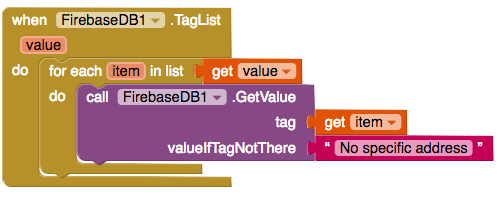
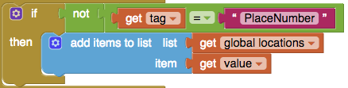

## Εμφάνιση δεδομένων στο ListView

Το επόμενο βήμα στην κατασκευή της εφαρμογής σου είναι να δημιουργήσεις έναν τρόπο για να βλέπεις όλες τις προσβάσιμες τοποθεσίες. Θέλεις να την προγραμματίσεις έτσι ώστε να βρίσκει όλες τις καταχωρήσεις τοποθεσίας και στη συνέχεια να προσθέτει καθεμιά απ' αυτές ως στοιχείο του ListView στην οθόνη ListOfPlaces. Για να το κάνεις αυτό, θα χρειαστείς ξανά το στοιχείο FirebaseDB.

+ Πήγαινε στην οθόνη ListOfPlaces και σύρε ένα στοιχείο FirebaseDB στην προβολή σχεδιαστή.

+ Τώρα πήγαινε στην προβολή Blocks και βγάλε ένα `when ListOfPlaces.Initialize` μπλοκ. Ό, τι περιέχεται σ' αυτό θα εκτελεστεί αμέσως μόλις ανοίξει αυτή η οθόνη.

+ Τοποθέτησε ένα μπλοκ `call FireBase.GetTagList` μέσα σε αυτό το μπλοκ. Αυτό λέει στη Firebase να επιστρέψει μια λίστα που να περιέχει τις ετικέτες (tags) όλων των αποθηκευμένων δεδομένων στη βάση δεδομένων σου.

+ Βγάλε ένα `when FireBase.TagList` μπλοκ και βάλε μέσα του ένα `for each item in list` μπλοκ. Αυτή η λειτουργία θα εκτελεστεί μόλις το Firebase πάρει το σύνολο των ετικετών (tags) με τη μορφή μιας λίστας, την οποία θα χρησιμοποιήσει ως μεταβλητή `value`.

Με το βρόχο `for` έχεις μεμονωμένες ετικέτες που έχουν οριστεί ως τιμές της μεταβλητής item. Φυσικά δεν θέλεις την ετικέτα, θέλεις τη διεύθυνση και θα χρησιμοποιήσεις την ετικέτα για να την αποκτήσεις.

Πιάσε ένα `call Firebase.GetValue` μπλοκ, και όρισε το tag στην μεταβλητή `item`, δεδομένου ότι αυτή περιέχει τo τρέχων tag από την `value` της λίστας.

+ Πρόσθεσε ένα `when Firebase.GotValue` μπλοκ και βάλε ένα μπλοκ `add items to list` μέσα σε αυτό.

+ Θα χρειαστείς μια λίστα για να προσθέσεις τοποθεσίες, έτσι πρόσθεσε ένα μπλοκ `initialize global name`. Άλλαξε το `name` σε `locations` και κούμπωσε ένα `create empty list` μπλοκ στο τέλος της.

+ Τώρα κούμπωσε ένα μπλοκ `get global locations` στην εσοχή list του μπλοκ `add items to list`, και ένα μπλοκ `get value` στην εσοχή item. Η μεταβλητή `value` περιέχει τη διεύθυνση της τοποθεσίας.

**Σημείωση**: Η λίστα των tags θα περιέχει επίσης την ετικέτα `"PlaceNumber"` που χρησιμοποιείς για να μετράς τις τοποθεσίες, επομένως θα πρέπει να την αποκλείσεις από τη λίστα που εμφανίζεται.

+ Πρόσθεσε ένα μπλοκ `if then` από το Control στο μπλοκ `GotValue` και μετακίνησε τον κώδικα `add items to list` έτσι ώστε να είναι μέσα στο μπλοκ `then`.

+ Στο `if` μέρος: κούμπωσε ένα `not` και ένα `=` από το Logic. Πέρνα το δείκτη του ποντικιού πάνω από τη μεταβλητή `tag` και βάλε ένα `get tag` στα αριστερά του `=`. Τοποθέτησε ένα μπλοκ κειμένου `""` στα δεξιά και πληκτρολόγησε μέσα του `"PlaceNumber"`.

+ Τέλος, πρέπει να πεις στο ListView να πάρει τα στοιχεία του από τη λίστα σου. Πάρε ένα `set ListView.Elements` μπλοκ και βάλε μέσα του ένα `get global location`.

