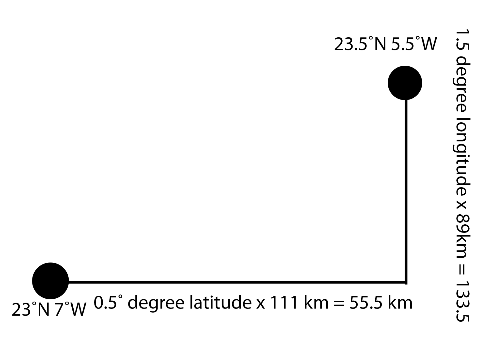

## Μαθαίνοντας την απόσταση μεταξύ δύο θέσεων

Μην ανησυχείς, θα κρατήσω τα μαθηματικά στο ελάχιστο. Δεν θα έχεις κανένα πρόβλημα κατανόησης και όπως και να'χει, πρόκειται να προγραμματίσεις έναν υπολογιστή για να κάνει τα μαθηματικά για σένα!

Αυτό που θέλεις είναι να εμφανίζονται μόνο οι τοποθεσίες που βρίσκονται κοντά στην τρέχουσα τοποθεσία ενός χρήστη. Για να γίνει αυτό, πρέπει να βρεις την απόσταση μεταξύ δύο διευθύνσεων.

Για να εξηγήσω πώς λειτουργεί αυτό, θα μιλήσω για τρία πράγματα:
  1. για το γεωγραφικό πλάτος
  1. το γεωγραφικό μήκος
  1. και για έναν αρχαίο τύπο που λεγόταν Πυθαγόρας

### Γεωγραφικό πλάτος και γεωγραφικό μήκος
Το γεωγραφικό πλάτος και το γεωγραφικό μήκος είναι γεωγραφικές συντεταγμένες. Επιτρέπουν τη περιγραφή της θέσης των τοποθεσιών χρησιμοποιώντας αριθμούς.

   **Παράδειγμα:** Το Spire, Δουβλίνο, Ιρλανδία βρίσκεται σε 53,3498 ° Β (γεωγραφικό πλάτος), 6,2603 ° Δ (γεωγραφικό μήκος)

+ Κατά μέσο όρο, η απόσταση μεταξύ δύο γραμμών γεωγραφικού πλάτους (δηλαδή η απόσταση μεταξύ κάτι που βρίσκεται στο 53° και στο 54°) είναι 111 χιλιόμετρα (69 μίλια).

+ Η μέση απόσταση μεταξύ δύο γραμμών γεωγραφικού μήκους είναι 89 χιλιόμετρα (55 μίλια).

Εξαιρετικά! Επομένως, αν γνωρίζεις το γεωγραφικό πλάτος και το γεωγραφικό μήκος δύο σημείων, μπορείς να βρεις την απόσταση των γραμμών γεωγραφικού πλάτους και γεωγραφικού μήκους που έχουν μεταξύ τους.

### Αυτός ο Πυθαγόρας που λέγαμε

+ Ίσως θα θέλεις να σχεδιάσεις αυτό το επόμενο κομμάτι! Αυτό που θα έχεις τώρα είναι το μήκος δύο γραμμών και αυτό που θέλεις είναι το μήκος της γραμμής που συνδέει τις κορυφές αυτών των δύο γραμμών.

Είσαι τυχερός! Το 500 π. Χ. ζούσε ένας μαθηματικός με το όνομα Πυθαγόρας. Ανακάλυψε ότι γνωρίζοντας τα μήκη των δύο πλευρών ενός τριγώνου (μιας και αυτό που έχεις είναι ένα τρίγωνο), μπορείς να υπολογίσεις το μήκος της τρίτης πλευράς.

Σκέφτηκε αυτή την εξίσωση   όπου το Z είναι η μεγαλύτερη πλευρά

+ Με αυτό στο νου, μπορούμε να εισαγάγουμε τις τιμές μας σε αυτήν την εξίσωση για να υπολογίσουμε το μήκος της γραμμής που μας ενδιαφέρει:     

Ιδού! Με αυτή τη μέθοδο, μπορείς να υπολογίσεις την απόσταση μεταξύ οποιουδήποτε χρήστη και της τοποθεσίας ενός προσβάσιμου χώρου! Εντυπωσιακό δεν είναι;

Στην επόμενη κάρτα, μπορείς να γράψεις μια **διαδικασία** που θα κάνει αυτόν τον υπολογισμό για σένα.
