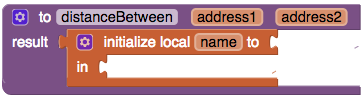
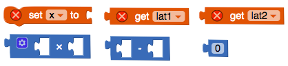
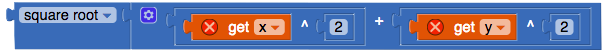
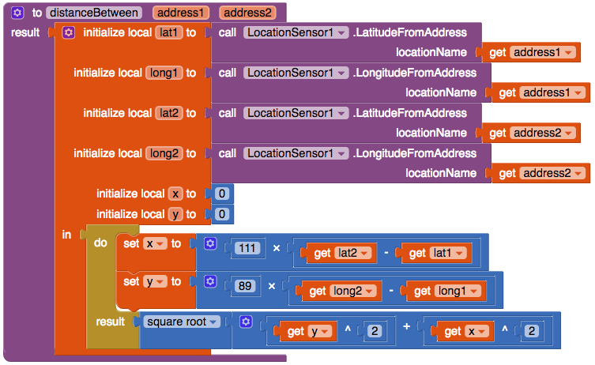

## Εφαρμογή μιας διαδικασίας για τον προσδιορισμό των αποστάσεων

Τώρα που γνωρίζεις πώς μπορείς να υπολογίσεις την απόσταση, μπορείς να κάνεις την εφαρμογή σου να εμφανίζει μόνο σημεία που απέχουν 5 χλμ. από έναν χρήστη.

+ Σύρε ενα μπλοκ **procedure** (αυτό με το result) και ονόμασέ το `distanceBetween`. Κάνε κλικ στο εικονίδιο με το γρανάζι στην επάνω αριστερή γωνία και σύρε δύο input μέσα στο inputs. Ονόμασέ τα `address1` και `address2`.

+ Στη συνέχεια, από την ενότητα "Variables", σύρε ένα μπλοκ `initialize local name to` (αυτό που έχει την προεξοχή σύνδεσης πλάι αριστερά αντί στην κορυφή).

+ Πρόσθεσε σε αυτό έξι μεταβλητές: `lat1`, `long1`, `lat2`, `long2`, `x` και `y`. Χρησιμοποίησε την ίδια μέθοδο που χρησιμοποίησες για την procedure, κάνοντας κλικ στο εικονίδιο με το γρανάζι στη γωνία του μπλοκ `initialise local`.

+ Τώρα χρειάζεσαι έναν τρόπο μετατροπής διευθύνσεων που είναι γραμμένες ως κείμενο σε συντεταγμένες γεωγραφικού πλάτους και γεωγραφικού μήκους. Ευτυχώς, το LocationSensor το κάνει αυτό, πήγαινε στην προβολή **Designer** και πρόσθεσε ένα.

+ Πάρε δύο `call LocationSensor.LatitudeFromAddress` μπλοκ. Σύνδεσε ένα μπλοκ `get address1` στο ένα και ένα μπλοκ `get address2` στο άλλο. Κούμπωσέ τα στα `lat1` και `lat2` αντίστοιχα.

+ Κάνε το ίδιο πράγμα με το γεωγραφικό μήκος.

+ Σύρε δύο `0` μπλοκ και κούμπωσέ τα στα `initialize local x to` και `initialize local y to` μπλοκ αντίστοιχα.

+ Πάρε ένα `do result` από το Control και κούμπωσέ το στην `in` εσοχή του (τώρα πολύ μεγάλου!) `initialize local` μπλοκ.

Εξαιρετικά! Τώρα πρέπει να υπολογίσεις την απόσταση.

+ Βγάλε τα μπλοκ `set x to`, `get lat1`, `get lat2`, `x`, `-` και `0`.

+ Βάλε τα `get lat2` και `get lat1` μπλοκ στο μπλοκ `-`, και το μπλοκ `-` στο μπλοκ `x`.

Τώρα έχεις τη διαφορά στο γεωγραφικό πλάτος!

+ Πολλαπλασίασε το αυτό με `111` για να πάρεις τις αποστάσεις σε χιλιόμετρα μεταξύ των δύο γεωγραφικών γεωγραφικών πλατών. Στη συνέχεια, απλώς συνδέστε το στο μπλοκ `set x to` και τοποθετήστε το `set x to` μπλοκ στο τμήμα `do` του μπλοκ `do result`.

+ Κάνε το ίδιο πράγμα με το μπλοκ `set y to`, αλλάζοντας το `111` σε `89` και το `lat` σε `long`.

Τέλεια! Με αυτό έχεις τα μήκη των δύο πλευρών του τριγώνου σου για να τα χρησιμοποιήσεις στον τύπο της απόστασης!

+ Από το τμήμα Math, πάρε τα μπλοκ `square root` (τετραγωνική ρίζα) και `+` μαζί με δύο μπλοκ `^`(ύψωση σε δύναμη) και δύο μπλοκ `0`.

+ Βάλε ένα `get x` στην αριστερή εσοχή ενός από τα `^` μπλοκ, και βάλε ένα `get y` στην αριστερή εσοχή του άλλου. Βάλε επίσης τα μπλοκ `0` στα μπλοκ `^`, με το `0` να αλλάζει σε `2`.

Αυτό θα τετραγωνίσει τόσο το `χ` όσο και το `y` (`χ` τετράγωνο είναι `χ` φορές το `χ`, που σημαίνει `x ^ 2 = x * x`).

+ Τοποθέτησε και τα δύο μπλοκ `^` στο μπλοκ `+` και κούμπωσε το τελευταίο στο μπλοκ `square root`. Τέλος, κούμπωσέ το αυτό στην εσοχή result. 

Να πώς θα πρέπει να είναι η ολοκληρωμένη διαδικασία `distanceBetween`:

