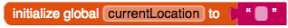
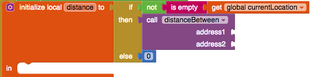
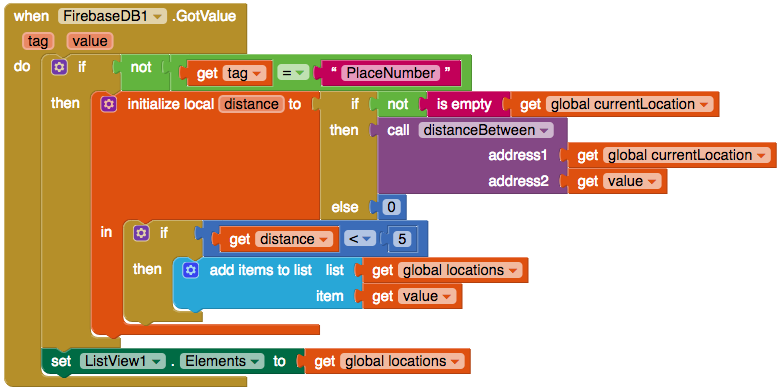

## Φιλτράρισμα κατά απόσταση

Εξαιρετικά! Τώρα έχεις μια διαδικασία που μπορεί να μετρήσει την απόσταση μεταξύ δύο διευθύνσεων. Στη συνέχεια, θα την προσθέσεις στη συνάρτηση `when FireBase.GotValue`.

Για αυτό χρειάζεσαι φυσικά δύο διευθύνσεις: τη διεύθυνση του προσβάσιμου χώρου και τη διεύθυνσή σου (τη διεύθυνση του χρήστη της εφαρμογής).

+ Πρώτα θα πρέπει να πάρεις την τρέχουσα θέση σου. Καθώς θα χρησιμοποιήσεις αυτήν την τιμή πολλές φορές, είναι καλή ιδέα να την αποθηκεύσεις ως μεταβλητή. Πρόσθεσε ένα `initialize global name to` μπλοκ, άλλαξε το όνομά του σε `currentLocation` και προσάρτησέ το σε ένα κενό μπλοκ κειμένου.

+ Στο `when ListOfPlaces.Initialize` μπλοκ, πρόσθεσε ένα `set global currentLocation to` μπλοκ και σύνδεσέ το με ένα `LocationSensor.CurrentAddress` μπλοκ.

Αλλά τι γίνεται αν η θέση του χρήστη δεν είναι διαθέσιμη; Για να καλύψεις αυτή τη πιθανότητα, πρέπει να κάνεις έναν έλεγχο πριν ορίσεις τη μεταβλητή `currentLocation`.

+ Βάλε ένα `if then` μπλοκ στο `when ListOfPlaces.Initialize` και μετακίνησε τον `set global currentLocation` κώδικα στο `then`.

+ Βρεςτο μπλοκ `LocationSensor.HasLongitudeLatitude` και κούμπωσέ το στο `εάν`:

Τώρα είσαι έτοιμος να χρησιμοποιήσεις τη διαδικασία που δημιούργησες για να πάρεις την απόσταση.

+ Εισήγαγε ένα `initialize local name to` μπλοκ (αυτό με την προεξοχή σύνδεσης στην κορυφή) στο `then` στο `when FireBase.GotValue` και άλλαξε το `name` σε `distance`.

+ Θέλεις να χρησιμοποιήσεις τον τύπο υπολογισμού της απόστασης, αν γνωρίζεις μόνο τη θέση του χρήστη, οπότε κούμπωσε ένα μπλοκ `if then else` (αυτό που έχει την εσοχή σύνδεσης στο πλάι). Στο `if`, κούμπωσε τρία μπλοκς: `not` (Logic), `is empty` (Text), και `get global currentLocation`.

+ Κούμπωσε ένα `call distanceBetween` μπλοκ στο `then`. Αν το `currentLocation` είναι κενό, θα εμφανίσει όλες τις τοποθεσίες, έτσι βάλε ένα `0` από το Math στο `else` για να επιστρέψει το μηδέν ως απόσταση.

+ Ως μία από τις **παραμέτρους** (τιμές που περνάνε στη συνάρτηση) `call distanceBetween`, κούμπωσε ένα `get global currentLocation` μπλοκ. Για την άλλη παράμετρο, κούμπωσε ένα `get value` μπλοκ (θυμήσου ότι αυτή περιέχει τη διεύθυνση της τοποθεσίας που πήρες από τη Firebase).

+ Μέσα στο `initialize local distance to` μπλοκ, πρόσθεσε ένα μπλοκ `if then`.

Τώρα θα ελέγξεις αν η απόσταση είναι μικρότερη από 5 χιλιόμετρα.

+ Πάρτε ένα `<` μπλοκ και ένα `0` μπλοκ από το τμήμα Math.

+ Βάλε ένα `get distance` μπλοκ στην πρώτη εσοχή στο μπλοκ `<` και το μπλοκ `0` στη δεύτερη είσοδο. Άλλαξε το μπλοκ `0` σε `5`.

+ Κούμπωσε το μπλοκ `<` στο μπλοκ `if then`.

+ Μετακίνησε το `add items to list` μπλοκ έτσι ώστε να είναι μέσα στην `then` δήλωση του μπλοκ `if then`.

+ Εάν όλα έχουν πάει σωστά, θα πρέπει να είναι κάπως έτσι:

