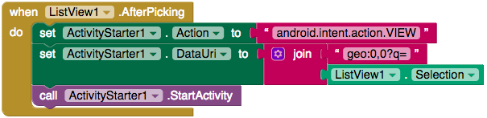

## Showing locations in a maps app

Wow! You’ve done so much, and the app is nearly finished. The last thing to do is to show people how they can get to a place.

In programming they say everyone builds "standing on the shoulders of giants". This means that you create programs by using what has already been done. In your case, to give people directions to a place, it would be best to use a maps application that's already installed.

On Android, this can be done by using the **StartActivity** method. This is part of the Android operating system and allows for applications to launch activities such as opening another app, taking a picture, etc. App Inventor can also run this method, but to do so, it needs a new component.

+ Go back the Designer view and drag in an **ActivityStarter** component from **Connectivity**.

OK, time to add the last bit of code!

+ Go back to the Blocks view and drag in a `when ListView.AfterPicking` block.

+ Create a `set ActivityStarter.Action to` block and drag a `""` block into it.

+ Inside this `""` block, write `android.intent.action.VIEW`. This is the action that you want to perform: you are telling Android that you wish to view something.

Of course you can view a lot of things: maps, websites, contacts, anything on the device. So you also need to tell the ActivityStarter what you want to view.

+ Take a `set ActivityStarter.DataURI` block and put it below the previous block.

You want to pass a string to this that tells Android that you want to see a map and also what location you want to see.

+ Get a `join` block and connect it to a `""` block. Into this you have to type the string `geo:0,0?q=`.

The `geo` part tells Android that you want a map, and the `?q=` part says that you want to see the address that follows.

+ Of course, you now need an address, so attach a `ListView.Selection` block.

+ Lastly, drag an `ActivityStarter.StartActivity` block into the previous block.

