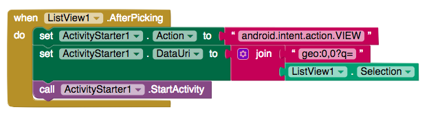

## Showing locations in a maps app

+  Wow! You’ve done so much, and the app is nearly finished. The last thing to do is to show people how they can get to a place.

+ In programming they say you build "standing on the shoulders of giants". This means that you do things by using what has already been done. In your case to give people directions to a place, it would be best to use a maps application already installed.

+ On Android this can be done by using the **StartActivity Method**. This is part of the Android operating system and allows for applications to launch activities. Such as opening another app, taking a picture, etc

+ AppInventor can also run this method, but to do so it needs a new component. Go back the **Designer** view and drag in a **ActivityStarter** component(**Palette** > **Connectivity**)

+ Ok, time to add the last bit of code! Go back to the **Blocks** view and drag in a `when ListView.AfterPicking` block.

+ Create a `set ActivityStarter.Action to` block and drag a `""` block onto it

+ Inside this `""` block write "android.intent.action.VIEW". This is the action that you want to preform, you are telling Android that you wish to view something.

+ Of course you can view a lot of things! Maps, websites, contacts, etc. You also need to tell the **ActivityStarter** what you want to view.

+ Take a `set ActivityStarter.DataURI` block and put it underneath the previous block.

+ You want to pass a string to this that tells Android that you want to see a map and also what location you want to see.

+ Get a `join` block block and connect it to a `""` block. In this you have to type with the string "geo:0,0?q=address", the **geo** part tells android that you want a map and the **?q=** part says that you want to see this address . Of course, you now need an address and so attach a `ListView.Selection` block.

+ Lastly drag a `ActivityStarter.StartActivity` block onto the previous block

