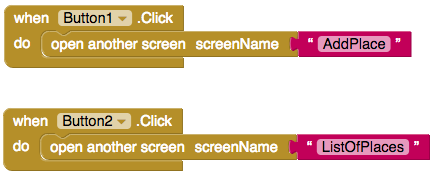

## Wrapping Up

You’ve finished, you now have a app that can add locations of accessible places to a shared database and then show people the places that are near to them.

+ But wait! One last thing! You need to let people go from one screen to another by clicking the buttons. I’ll let you see can you figure it out.

--- hints ---

--- hint ---

+ You'll need to add code to your the `Button.Click` of the buttons.

+ Look in the **Control** blocks! 

--- /hint ---

--- hint ---

+ Here is the code you need to add to the home screen:

--- /hint ---

--- /hints ---

+ Now all that is left for you to do is to test it! Go to **Connection** menu and then select either the emulator, AICompanion, or whichever other method applies to you.

That's it! Completed! I wonder what else you can do now with all the things you have learned. Below are just a few suggestions, but you could think of cooler ideas yourself.

--- collapse ---
---
title: Show the distance to places
---

+ At the moment you get rid of all places that are further than 5km, but the user can’t see the distance to an individual place. How about adding another **label** to the list containing the distance to that place!

--- /collapse ---

--- collapse ---
---
title: Better distance calculation
---

+ On the topic of working out the distances, the method you are using to work out distance in these cards is a bit inaccurate. How about you try to build an even better system! Do some googling for **AppInventor working out distances**.

--- /collapse

--- collapse ---
---
title: Use a map instead of typing addresses
---

+ Or, maybe you could add a map to the "AddPlace" screen. At the moment you have to type in an address, but what if you could just find it on a map. That would be even cooler!

--- /collapse ---

--- collapse ---
---
title: Make a different app!
---

+ But there is no reason to even stay working on this app. The possibilities are endless. With the same blocks you could use **Firebase** to make a messaging app or take advantage of the **Clock** to make your own alarm clock!

--- /collapse ---

You can see an example of this app on App Inventor at [dojo.soy/advancedapp](http://dojo.soy/advancedapp){:target="_blank"} 