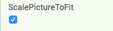

## Creating the layout

+ Create a new project in App Inventor and name it “AccessApp”, or come up with a catchier name of your own!

+ First you're going to setup a home screen. Add a label and two buttons to your app. Make the label say the name of the app, and set the buttons' texts to "Add a place" and "Nearest accessible place".

+ Now I don’t know about you, but I think the title should be bigger! Go to the label’s Properties and change the FontSize to something nice and large. I chose 28 but you could go bigger!

+ Now since you have that new, nice, large title, you can get rid of one at the top of the screen. Click on the screen under **Components**, then in its Properties uncheck the **TitleVisible** checkbox.

+ Those buttons are a bit small too. Go to their properties and change their widths to `Fill parent`.

+ Finally, let’s add an image. Find or draw a suitable image or use the one at: [dojo.soy/accessicon](http://dojo.soy/accessicon). 

+ Now, get an Image component and drag it onto the screen. In its properties find **Picture**, then **Upload File**, and upload the image you downloaded.

--- collapse ---
---
title: Centering something
---

Depending on the size of your image it might be be cool if it was displayed in the centre of the screen. 

+ To do that you will need a HorizontalArrangement from **Layout**. Drag one onto the screen and move your Image into it.

+ Now click on the HorizontalArrangement and go to its properties. Set the Width to `Fill parent`, then find **AlignHorizontal** and switch it to `Center: 3`.

--- /collapse ---

--- collapse ---
---
title: My picture is bigger than the screen
---

If you're using a picture that's too big, no problem!

+ Click on the image and look at its properties.

+ Check the box **ScalePictureToFit**. This will shrink the picture to fit the screen.

--- /collapse ---

+ Awesome! You’ve just finished the first screen. Here’s what mine looks like

+ Now make another screen named "AddPlace".

+ Like before, add a label with the screen's title. Also add another Label saying "Location:", a TextBox and two Buttons, "Current Location" and "Save Place".

+ Now try out some of your new skills. Give the textbox a width of "Fill parent" and use two HorizontalArrangements to center both of those buttons.

+ It might look better if the save button was at the very bottom. Change the height of its HorizontalArrangment to `Fill parent` and then just set its AlignVertical property to `Bottom: 3`.

+ Awesome! You should have something like this:

+ Now you just need to add one more screen. Name it "ListOfPlaces".

+ This one is really simple, drag a ListView out and change its Height to `Fill parent`.

That's all your screens ready to go!
