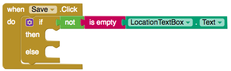

## Getting the user's location

If you want to know where the accessible places near you are, you are going to need users to add their locations to your app. Luckily, App Inventor has a **LocationSensor** component that detects a user's location.

+ On the "AddPlace" screen, drag a LocationSensor from **Sensors** onto your app.

You’re now going to get the user’s location and put it into the **TextBox**.

+ Switch over to the Blocks view and drag two `when Button.Click` blocks onto the screen.

--- collapse ---
---
title: Renaming components
---

I like giving my components identifiable names. 

+ In the Designer view, click on the component. At the bottom of the **Components** section, click **Rename**. 

+ I called my Buttons "currentLocation" and "Save".

--- /collapse ---

+ Drag a `set TextBox.Text` block onto the screen and put it in your "Current Location" Button.

+ Now drag a `LocationSensor.CurrentAddress` block out and attach it to the `set TextBox.Text` block.

Great! Now when you click on "GetLocation", the TextBox’s text will be set to your current address from the LocationSensor.

You need to be careful though: it's a good idea to check that there is always an address in the TextBox before adding a new place! You need to **validate the input**.

+ Drag out an `if, then, else` block, and put it into the `when Save.Click` block.

+ Now you need to make the `if` condition check if the TextBox has text in it. Drag out an `is empty` block, and attach it to a `TextBox.text` block.

+ OK, now you can check whether the TextBox is empty, but you want to check if it is **not** empty. To do this, get a `not` block out and put it before the `is empty` block.

One last thing: you need to tell the user that the TextBox is empty.

+ Switch over to the Designer view and drag a Label into the app. Give it a warning message and set the text color to red. Finally, uncheck the **Visible** checkbox.

+ You'll want to show this label for a second, so you are going to need a **Clock**. Drag one out from Sensors — it will appear with the other non-visible components below the app screen. 

+ Uncheck the clock's **TimerEnabled** checkbox so it doesn’t fire right away!

+ Back in the Blocks view, drag a `set Label.Visible` and a `set Clock.TimerEnabled` block out and attach both of them to `true` blocks. Then put both in the `else` statement.

Nearly there! Now, if there is no text in the **TextBox**, your warning label will become visible and your clock will be enabled. You just need to make the label invisible again after about a second, so the user doesn't have to keep looking at it.

+ Take out a `when Clock.Timer` block and duplicate the two blocks you just made. Change `true` to `false` and put duplicate blocks inside the `when Clock.Timer` block.

