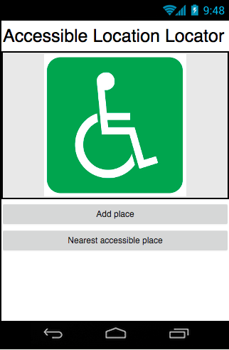

## Creating the layout

+ First your going to setup a home screen! Add a label and two buttons to your app. Make the label say the name of the app, and set the buttons texts to "Add a place" and "Nearest accessible place".

+ Now I don’t know about you, but I think the title should be bigger! Go to the **Label’s** Properties and find **FontSize**. Change this to something nice and large. I chose 20!

+ Now since you have that new, nice, large title, you can get rid of one at the top of the screen. Click on the Screen, then in its **Properties** uncheck the **TitleVisible** checkbox.

+ Those **Buttons** are a bit small too. Go to their **Properties** and change their width to **Fill parent**.

+ Great! Finally let’s add an image! Find or draw a suitable imagee or use the one at: [dojo.soy/accessIcon](TODO-LINK). If you’re finding one try and get it to be 240px × 225px or smaller. You could use a bigger one, but some fiddling with the size will then be needed!

+ Now, get an **Image** Component and drag it onto the screen. Finally in the **Properties** section find **Picture**, then **Upload File**, and upload the image you downloaded.

--- collapse ---
---
title: My picture is bigger than the screen
---

If you're using a picture that's too big, no problem! Instead of following the steps below to center the picture, do the following:

+ Click on the image and look at its properties.

+ Check the box **ScalePictureToFit**. This will shrink the picture to fit the screen.

--- /collapse --

+ Perfect! But it would be cool if that image was in the centre of the screen. To do that you will need a **HorizontalArrangement**(**Palette** > **Layout**). Drag one onto the screen and move your **Image** into it.

+ Now click on the **HorizontalArrangement** and go to its **Properties**. Find **AlignHorizontal** and switch it to **Center: 3**.

+ Awesome! You’ve just finished the first screen. Here’s what mine looks like

+ Now make another screen named "AddPlace".

+ Like before add a **Label** with the screen's title. Also add another **Label** saying "Location:", a **TextBox** and two **Buttons** ("Current Location" and "Save Place").

+ Now try out some of your new skills. Use two **HorizontalArrangements** to center both of those **Buttons**, and give the **TextBox** a width of of **FillParent**!

+ It might look better if the save button was at the very bottom. Change the height of its **HorizontalArrangment** to **FillParent** and then just set its **AlignVertical** property to **Bottom: 3**.

+ Awesome! You should have something like this:

+ Now you just need to add one more screen, name it "ListOfPlaces".

+ This one is really simple, drag a **ListView** out and change its **Height** to **Fill parent**.
