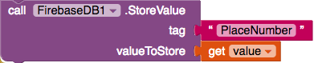

## Saving data to Firebase

To allow for all users of your app to see all the accessible places you need to store the data online. To do this, App Inventor has a Web database, where you can write values to and then later get them back.

+ Staying on the **AddPlace** screen, go to the **Designer** view and drag a FirebaseDB (**Palette** > **Experimental**) component into your app. Don't worry if you get a popup message, just go ahead and click OK.

+ Back in the Blocks, add a `call FirebaseDB.StoreValue` block.

--- collapse ---
---
title: What are tags and values?
---

You can see that the `StoreValue` block is asking for two values:
  1. The **tag** is an unique identifier which you will use to retrieve the data later.
  2. The **value** is the data that you want to save

The important thing is that a **tag** has to be unique(i.e. It is only used once). You need to make sure that nobody ever reuses the same tag. If this were to happen, then the data under that tag would be lost!

To make sure this doesn't happen you will tell Firebase to store a value "PlaceNumber" which you will keep adding to. This will then be your tag.

--- /collapse ---

+ Add a `call Firebase.GetValue` block to the `then` statement in the `when Save.Click`.

+ Put a `text` block with "PlaceNumber" for the **tag** and a `0` block for the **ValueIfTagNotThere**.

--- collapse ---
---
title: Why is the value not returned?
---

What will happen now is your code will ask Firebase for the current amount of places. Firebase will look for this and when it finds the value, it will call another function, in this case `GotValue`.

This is known as an **asynchronous call** and means your app can keep running while it waits for Firebase!

--- /collapse ---

+ When Firebase finds the value it will run the `GotValue` function. So go ahead and add a `when Firebase.GotValue` block, so you can run some code when this happens.

+ Firstly you need to increment the amount of the places (as you are adding a new one). Hover over `value` and drag out a `set value to`. Put this into the `when Firebase.GotValue` block. Also take out a `get value` block.

+ From Math, drag out the `+` block along with a `0` block. Set the `0` block to `1`.

+ Place the `get value` and the `0` block into the `+` block and attach this to the `set value to` block.

+ Ok, so now you have your a unique **tag**. You have just increased the previous placeNumber by one. The next time sometime tries to add a place they will do the same, and so your **tag** will stay  unique!

+ Drag the `call FirebaseDB.StoreValue` block you added previously to underneath the `set value to` block

This block tells Firebase to add the location (the address in the textbox) to the database. When you want to find the address again you can use its **tag** (the place number).

+ Attach a `get value` block to the `tag` attachment and a `TextBox.text` to the `value` attachment.

+ The only thing left now to do is change the amount of places in Firebase. This is exactly the same as the previous block just with the tag and value changed. Try it yourself! It should go just underneath the previous `call Firebase.StoreValue` block.

--- hints ---

--- hint ---

+ The value you want to store is the new value for the number of places.

+ Use the tag you defined earlier for getting and storing the current place number.

--- /hint ---

--- hint ---

+ To update the place number you need `call FirebaseDB.StoreValue` with a `tag` of `"PlaceNumber"` and a `value` of `get value`. Here is what the code looks like:

--- /hint ---

--- /hints ---

+ Fantastic! Now you can add new places to the app. Just add a `open another screen screenName` block and attach it to a `""` block. Type in `Screen1` here, so you can get back to the home screen.

Your `GotValue` code should look like this now:

