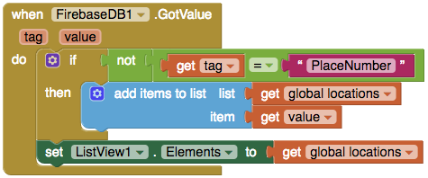

## Displaying data in the ListView

+ The next step in the making of your app is having a way to see all the accessbile places.

+ You want to program it such that you will find all the place entries and then add each one as an element of the **ListView** in the **ListOfPlaces** screen.

+ To do this you are to need the **FirebaseDB** component again, so go ahead and drag one out.

+ Now switch over to the **ListOfPlaces** screen, and take out a `When ListOfPlaces.Initialize` block. Everything in this will run once you open up this screen.

+ Place a `call FireBase.GetTagList` block inside this block. This will tell Firebase to return you a list containing the tags of all saved data in your database.

+ Take out a `when FireBase.TagList` block and insert a `for each item in list` block inside it. This function will run as soon as Firebase gets our collection of tags in the form of a **list**, and puts this list into the **value** variable.

+ Of course you don’t want the tag, you want the address! You just need the tag to get it. With the for loop you now have individual tags being set to the item variable. Grab a `call Firebase.GetValue` block, and set the tag to the **item** variable, since this contains the current tag from the **value** list.

+ Add the `when Firebase.GotValue` block and inside it put a `add items to list` block.

+ You will need a list to add our locations to, so add a `initialize global name` block. Change its "name" to "locations" and drag a `create empty list` block onto the end of it.

+ Now attach a `get global locations` block to the **list** attachment of the `add items to list` block and a `get value` to the **item** attachment. The **value** variable contains the address of the place.

+ Lastly you need to tell the ListView to get its elements from your list. Get a `set ListView.Elements` block and attach a `get global locations` to it.

