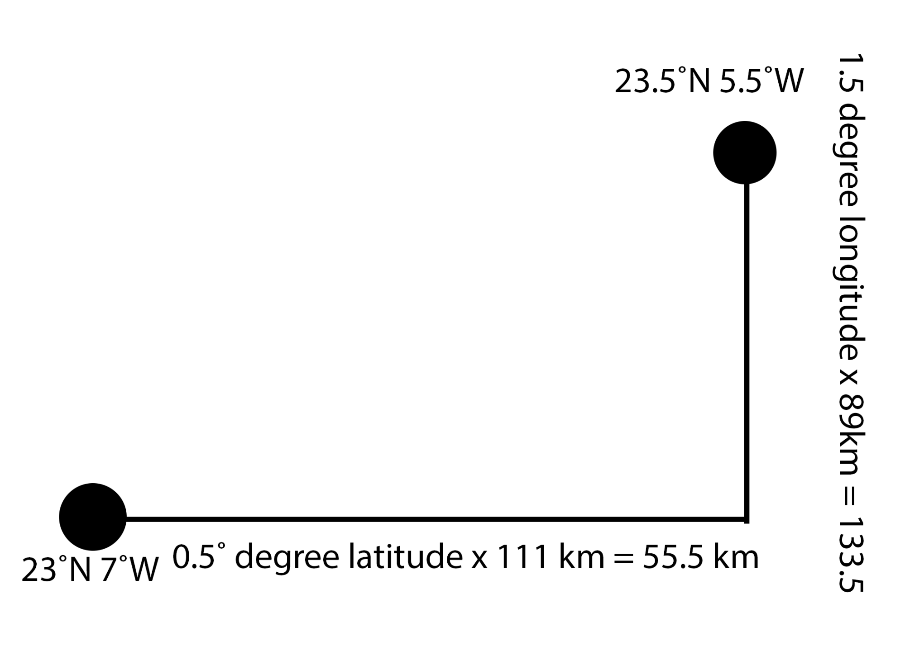

## Working out the distance between two locations

Ok, don’t worry, I’ll kept the maths to a minimum. Really, you’ll have no problem understanding it, but even if you don’t, you’re going to be programing a computer to do the maths for you!

What you want to do now is to only show places that are close to where a person currently is, and to do this you need to find the distance between two addresses.

Here I will be talking about three things:
  1. Latitude
  2. Longitude
  3. An old-guy named Pythagoras

### Latitude and longitude
Latitude and longitude are geographic coordinates. They allow for the position of places to be said using numbers.  

   **Example:** The Spire, Dublin, Ireland is located at 53.3498° N (latitude), 6.2603°W (longitude)

+ On average the distance between two lines of latitude (i.e. The distance between something at 53° to something at 54°) is 111 kilometers (69 miles).

+ The average distance between two lines of longitude is 89 kilometers (55 miles).

Great! So now knowing the latitude and longitude of two points you can find the distance their latitude and longitude lines are apart.

### That Pythagoras guy

+ You might want to draw out this next bit! What you have now is the length of two lines but what you really want is the length of the line that connects the tops of these two lines.

You are in luck however! Because in the 500s BC there lived a mathematician named Pythagoras. He discovered that by knowing the lengths of two sides of a triangle (for what you have is a triangle) you can work out the length of the third side.

He came up with the equation   where Z is the largest side

+ So knowing this you can insert our values into this equation:

Tada! Knowing this you can work out the distance between any person and the location of an accessible place! Pretty cool!

On the next card you will write a **procedure** that can do this calculation for you.
