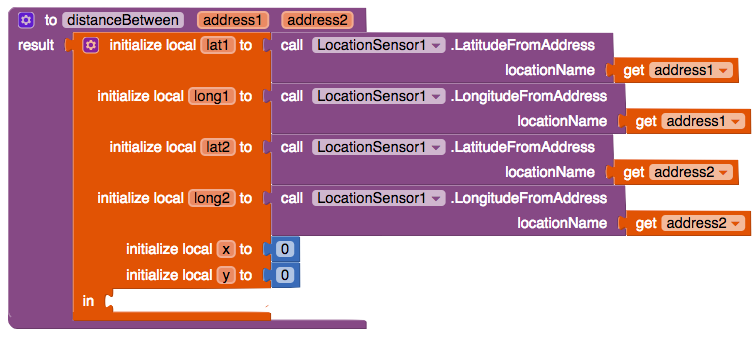

## Implementing a procedure to work out distances

Now that you know how to work out distance you can show only places that are within 5km of a person.

+ Drag out a **procedure** block (the result one) and call it `distanceBetween`. Click on the wrench icon in the top left and drag two inputs into it, name them `address1` and `address2`.

+ Next, from the **Variables** section, drag a `initialize local name to` block out (The one that has a side attachment instead of a top attachment).

+ Add six variables to this: "lat1"; "long1";  "lat2"; "long2"; "x"; and "y". Use the same method you used for the procedure, by clicking on the wrench icon in the corner of the `initialise` block.

+ You are going to now need a way of converting text addresses into latitude and longitude coordinates. Thankfully the LocationSensor does this. Go to the **Designer** view and add one.

+ Get two `call LocationSensor.LatitudeFromAddress` blocks. Attach a `get address1` block to one and a `get address2` block to another. Put these into the `lat1` and `lat2` attachments.

+ Repeat the same thing with Longitude.

+ Drag in two `0` blocks and attach these to `initialize local x to` and `initialize local y to`.

+ Get a `do result` block from Control, and put it into the `in` attachment of the `initialize local to` block.

+ Great! Now you need to work out the distance of two sides. Bring a `set x to`, `get lat1`, `get lat2`, `x`, `-`, and `0` block out.

+ Place the `get lat2` and `get lat1` block into the `-` block, and place the `-` block into the `x` block.

+ Now you’ve got the difference in latitude! So multiply it by 111 to get the kilometers between them. Then just plug that into the `set x to` block, and put the `set x to block` into the `do` section of the `do result` block.

+ Make the same thing with the `set y to` block, changing `111` to `89` and `lat` to `long`.

Perfect! With that you have the lengths of two of the triangles sides for the distance formula!

+ From the **Math** section get the `square root` and `+` blocks along with 2 `^`(power) blocks and two `0` blocks.

+ Put a `get x` into the left input of one of the `^` blocks and a `get y` into the left input of another. Put the `0` blocks into the `^` block also, with 0 changed to 2. This will square both x and y(i.e. x^2 = x * x)

+ Place both `^` blocks into the `+` block and attach this to the `square root` block. Finally plug this into the result attachment.

Here is what your finished `distanceBetween` procedure should look like:

