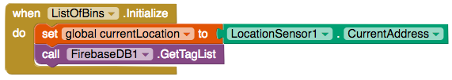
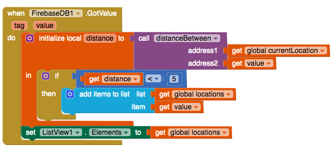

## Filtering by distances

+ Great! You now have a procedure that can work out the distance between two addresses. Next you have to add this to your `when FireBase.GotValue` function

+ Insert an `initialize local name to` block(the one with a top attachment) and change "name" to "distance". Connect it with a `call distanceBetween` block. For this you now need two addresses: the address of the place  and your address.

+ First you should get your current location. As you will be using this value multiple times it would be a good idea to make a variable contain it. Add a `initialize global name to` block, change its name to **currentLocation** and set it to an empty `text` block.

+ In the `when ListOfPlaces.Initialize` block add a `set global currentLocation to` block and connect it with a `get LocationSensor.CurrentAddress` block.       

+ Go back to the `call distanceBetween` block. For one of the **parameters**(values that you are passing to the function) attach a `get global currentLocation` block and for the other **parameter** attach a `get value` block. (Remember this contains the address of the place).

+ Inside the `initialize local distance to` block add an `if then` block.

+ You are now going to check if the distance is less than 5km. Get a `<` block from the **Math** section along with a `0` block.

+ Put a `get distance` into the first input in the `<` block and the `0` block, set to 5, into the second input. Plug the `<` block into the `if then` block.

+ Move the `add items to list` block to be inside the then statement of the `if then` block.

+ If everything has gone correctly it should look like

